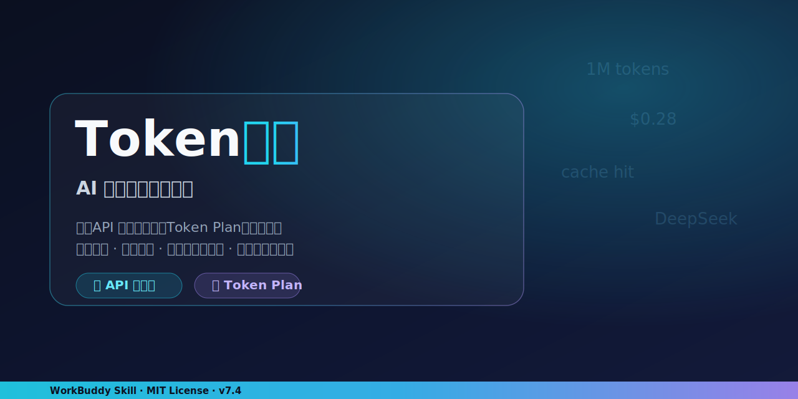

<p align="center">
  
</p>

# Token买手 — AI算力采购决策专家 🛒

<p align="center">
  <a href="./LICENSE"></a>
  
  =18">
  =3.10">
  
  
  
  
</p>

> **花最少的时间，买最值的 AI 算力**

Token买手是一个开源的 AI 算力采购决策工具，帮你**比价 → 算折扣 → 直接告诉你该买谁**。覆盖 API 中转站（第三方平台）和 Token Plan（官方订阅套餐）两大赛道。

---

## 它能做什么

### 🅰️ API 中转站比价
跨平台对比第三方 API 价格，自动识别模型别名、统一计价单位、标记渠道风险。

### 🅱️ Token Plan 对比
分析官方订阅套餐，从 Token 额度、窗口限制、多模态能力、Agent 并发等维度全面对比。

### 🅲 真实折扣反推
用各平台**官方 API 真实单价**反算每个套餐的"等效 API 价值 + 实际折扣率"，告别拍脑袋估价。

**输出格式**：分析过程 → 按预算/使用画像推荐 → 速查卡片的三段式决策报告。

---

## 快速开始

### 方式一：作为 WorkBuddy Skill 使用

```bash
# 将 token-buyer 文件夹放入 WorkBuddy 的 skills 目录
cp -r token-buyer ~/.workbuddy/skills/
```

然后直接对话触发：

| 你说 | 它做什么 |
|:----|:--------|
| "对比我给你的所有 Token Plan" | 启动全量对比 |
| "丢个链接 https://..." | 自动抓取 → 入库 → 全量对比 |
| "我该买谁" | 直接给结论，不让你看表 |

### 方式二：独立脚本运行

```bash
# 爬取第三方平台价格
node scripts/scraper.js zenmux

# 价格标准化与对比分析
python scripts/price_normalizer.py

# 反推 Token Plan 折扣率
node scripts/reverse_calc.js
```

---

## 文件结构

```
token-buyer/
├── SKILL.md                          # 主文件：定位、流程、规则
├── CHANGELOG.md                      # 版本演进记录
├── README.md                         # 本文件
├── LICENSE                           # 开源许可证
├── references/
│   ├── api-base-price.md             # 折扣反推方法论与计算示例
│   ├── platform-rules.md             # API 中转站计价规则
│   ├── model-aliases.md              # 跨平台模型名称映射
│   └── token-plan-rules.md           # Token Plan 对比维度、平台档案、抓取指南
├── scripts/
│   ├── scraper.js                    # 三层爬取引擎（API探测→浏览器→引导导出）
│   ├── price_normalizer.py           # 价格标准化、合并、异常检测
│   └── reverse_calc.js               # 真实折扣率反推（读取 data/token-plans.json）
├── templates/
│   └── output-template.md            # 三段式输出模板（权威版本）
└── data/
    ├── token-plans.json              # ⭐ 唯一数据源：套餐 + API单价 + Credits兑换率（自有整理，带 source_url/confidence）
    └── sample.json                   # 纯合成格式样例（无第三方内容）
```
> 第三方平台抓取快照（`*_scraped.json` / `apikeyfun_*.json`）仅本地使用，**不进开源仓库**（已在 `.gitignore` 排除）。

---

## 已覆盖的平台

**API 中转站（7家）**：ZenmuxAI / HaoshuangAPI / yunwu.ai / APIKEY.FUN / APIMart / GrsAI / GeekNow

**Token Plan（5家）**：MiniMax / 智谱 GLM / Kimi / Command Code / 通义千问 Qwen

---

## 核心设计原则

1. **交付必须给结论**：用户看完报告必须知道买谁，不能只有数据表格
2. **敢说不推荐**：性价比低的套餐直接标注"垃圾套餐，别碰"
3. **每推荐必附短板**：不隐恶，每个推荐同时写明"这个方案不能做什么"
4. **按使用画像反推**：先问月均调用次数/场景/团队规模，再推荐
5. **组合套餐视角**：考虑"两个便宜的"是否比"一个贵的"更划算
6. **硬性验证门禁**：`node scripts/reverse_calc.js` 跑完每个套餐自动输出 Sanity Check 摘要，基于 `token-plans.json` 的 `confidence` 字段触发——`estimated` 单价强制"需 WebFetch 复核"、折扣率 >100% 标"溢价"、<0.5% 标"异常便宜"。凡带 `⛔` 的项，发布前必须人工核查，不靠自觉兜底

---

## 数据说明

- **`data/token-plans.json` 是唯一数据源**：套餐、API 单价、Credits 兑换率均以此为准，每条数据带 `source_url` 与 `as_of` 日期
- 数据有时效性：推荐前必须复核各平台官方定价页最新价格
- `data/*_scraped.json` 为公开定价信息的抓取样本，仅作格式示例
- 汇率统一按 1 USD = 7 CNY 折算

---

## 开源许可

MIT License — 详见 [LICENSE](LICENSE) 文件。

---

## 免责声明

- 本工具提供的价格对比仅供参考，实际价格以各平台实时数据为准
- 不构成任何投资或采购建议
- 抓取的数据来自各平台公开页面，请遵守目标平台的使用条款
- 数据可能有延迟，使用前建议验证最新价格
